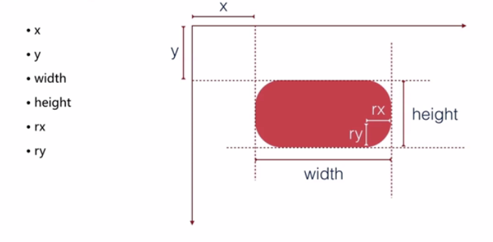
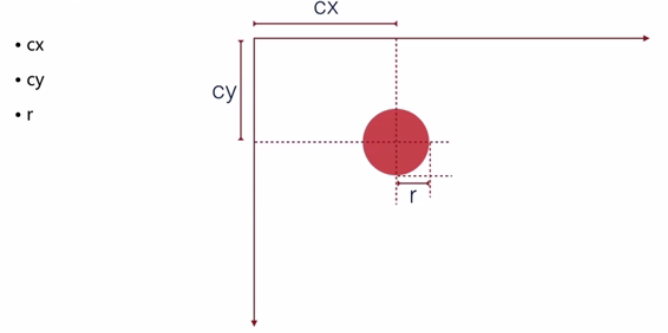
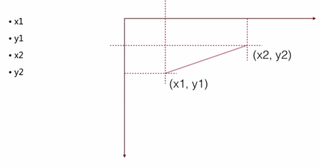
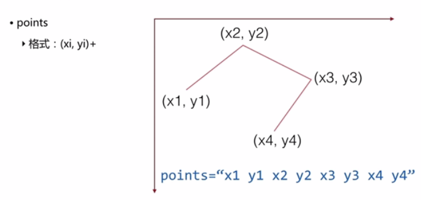
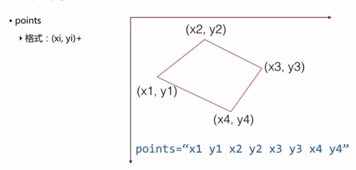
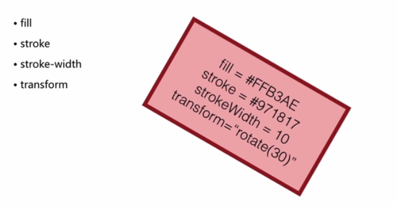

# svg

## svg打开方式

> * 浏览器直接打开
> * 插入到HTML代码中
> * 可以放在img标签
> * 可以用于background-image: url(demo.svg)

## 基本图形和属性

### 基本图形
rect、circle、ellipse、line、polyline、polygon

* path是高级图形

### 基本属性
fill、stroke、stroke-width、transform

## 矩形（rect）

rx、ry如果只给某一个值，那么rx=ry（默认）

## 圆（circle）

cx、cy是根据圆心为标准

## 直线（line）

## 折线（polyline）

## 多边形（polygon）

## 填充、描边和变换

# 基本操作API

## 创建图形

document.createElementNS(ns, tagName)

## 添加图形

document.appendChild(childElement)

## 设置/获取属性

element.setAttribute(name, value)

element.getAttribute(name)

# SVG 中的坐标系统和坐标变换

>* SVG 的世界、视野、视窗的概念
>* SVG 中的图形分组
>* 坐标系统概述
>* 自身坐标系和参照坐标系
>* 坐标变换

## SVG 的世界、视野、视窗的概念

width、height-控制视窗（浏览器显示的视窗）

SVG代码-定义世界

viewBox、preserveAspectRatio-控制视野（SVG本身的视野）

## SVG 中的图形分组

g标签创建分组

属性继承

transform属性定义坐标变换

可以嵌套使用

## 坐标系统概述

笛卡尔直角坐标系

原点

互相垂直的两条数轴

角度定义

## 四个坐标系

用户坐标系（世界坐标系）

自身坐标系（每个图形元素或分组独立与生俱来）

前驱坐标系（父容器的坐标系）

参考坐标系（使用其它坐标系来考究自身的情况时使用）

